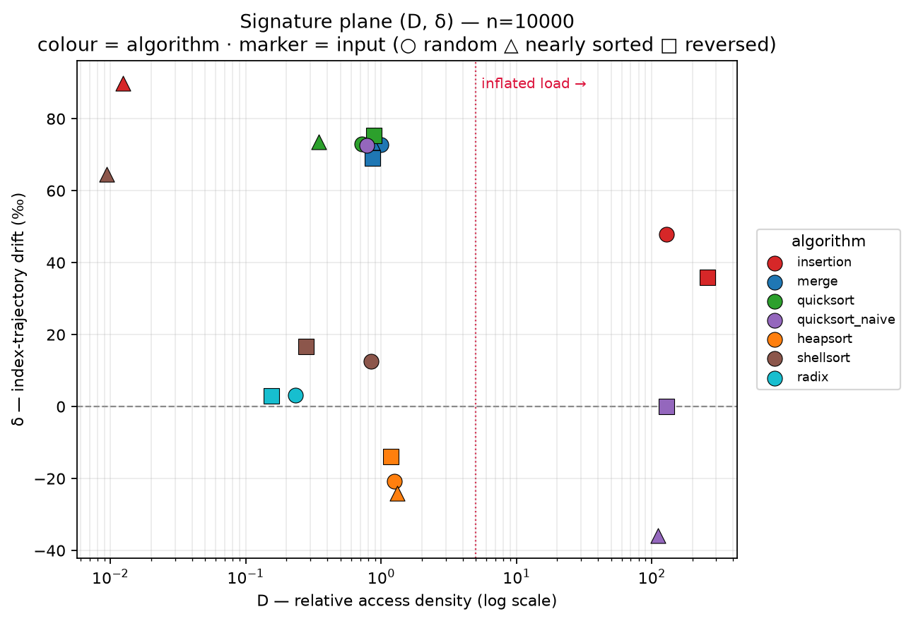

# (D, δ): a two-feature signature for memory-access traces

[](https://github.com/and2carvalho/memory-access-signature/actions/workflows/ci.yml)
[](LICENSE)
[](LICENSE-DATA.md)

A low-cost, calibration-free signature that compresses the memory-access trace of a
logical array into two numbers, and uses them to detect performance degradation in the
*same code* without per-class calibration. The repository contains two independent
implementations (TypeScript and Python) that reproduce every published number bit for
bit, a pre-registered cross-domain validation, and a robustness analysis that delimits
what the signature can and cannot resolve.

This work is part of the author's master's research in Computer Science at the Federal
University of Uberlândia (PPGCO/UFU), on minimal representations of execution traces for
systems observability. A manuscript is in preparation.

## The signature

For an algorithm `a` that accesses a logical array `A[0..n−1]`, every read or write of `A`
records the accessed **global index**. From that trace:

- **D — relative access density.** `D(a) = E(a) / E(ref)`, where `E(a)` is the total
  number of accesses and `E(ref)` that of a fixed reference (Merge Sort on random input at
  the same `n`). D is information-equivalent to an access counter; its value is
  operational — O(1) state per event and no per-class calibration — and it isolates
  inflated workloads.
- **δ — index-trajectory drift.** The trace is split into `b = 10` equal temporal bands;
  δ is the least-squares slope of the mean normalized index over normalized time,
  reported in ‰ per 1% of the trace. δ summarizes the **net direction** of the access
  trajectory: forward scans give δ > 0, traversals that return towards the origin give
  δ < 0.

Traces longer than 10⁵ events are reduced by order-preserving reservoir sampling, so both
features can be computed in a streaming fashion.

## Main results

All values below are read from `output/*.json` and `robustness/output/*.json`.

**1. Degradation of the same code is visible in two numbers.** Naive QuickSort (Lomuto,
last-element pivot) on random input behaves like the other O(n log n) algorithms
(D = 0.78, δ = +72.5 at n = 10⁴). On adversarial inputs it degenerates to O(n²): D rises to
112–129 (≈ 150× higher), with **two distinct drift signatures** — δ ≈ 0 on reversed
input and δ ≈ −36 on nearly sorted input. D indicates *that* the code degenerated; δ
carries information about *how*.

**2. D separates load categorically.** At n = 10⁴, the four quadratic cases lie at
D ∈ [112, 258], while every other algorithm–input combination lies at D ∈ [0.009, 1.31].
Below D ≈ 1.3, differences in D are within run-to-run variation and are not interpreted.



**3. Scaling with n recovers complexity classes.** Fitting `D(n) = C·nᵛ` over
n ∈ [10³, 2·10⁴]: under the O(n log n) normalization, an O(n²) workload is expected at
ν ≈ 0.88 (the exponent of n/log n, not 1) and an O(n) workload at ν ≈ −0.12. The fits
recover both extremes (Insertion / random ν = 0.880 ± 0.005; Radix ν = −0.127 ± 0.014,
R² = 0.997), resolve intermediate regimes (Shellsort / random ν = 0.138 ± 0.017) and
expose input sensitivity of adaptive algorithms (Insertion: ν = 0.880 on random input,
−0.112 on nearly sorted input).

**4. The discriminators are stable across sizes.** Over the 21 algorithm × input series,
the load regime is consistent across n in 21/21 series and the sign of δ in 20/21; the
only exception is naive QuickSort on reversed input, whose δ oscillates within ±0.1
around zero. k-means on the standardized `(log D, δ)` plane gives silhouette scores from
0.51 (k = 2) to 0.74 (k = 6).

**5. The thresholds transfer outside sorting (pre-registered).** Four non-sorting
workloads — linear reduction, bottom-up tree fold, random probing and a nested-loop
self-join — were measured under the thresholds calibrated on sorting, with hypotheses
written beforehand ([pre-registration](docs/preregistration.md)). All four hypotheses are
supported with wide margins, and the load boundary detects a *structural* O(n²) workload
(self-join, D = 70 → 958) as well as input-triggered degeneration. The self-join also
shows that the two axes are independent: D = 958 and δ = +45 simultaneously.
[Full results](docs/cross-domain-results.md).

**6. Robustness analysis.** [The main objections to the role of δ were tested quantitatively](robustness/README.md):

- δ is an **order statistic**: permuting the event order collapses it by 145–378×.
- The sign of δ is robust to reservoir size (1,000 of 8·10⁸ events preserve it).
- The banded regression is **one of many equivalent trend estimators** (raw OLS:
  ρ = 0.997, same verdicts).
- The Heapsort vs Merge/QuickSort separation is matched by an **order-blind** statistic
  (mean accessed index, 2.05σ for both). The temporal contribution of δ is established
  in the forward vs backward trend cases, where the order-blind statistic fails.
- The magnitude of δ and the near-zero band depend on the number of bands `b`; only the
  sign should be interpreted.

## Scope and limitations

- **The δ ≈ 0 region is ambiguous.** A multi-pass sequential scan (Radix, δ = +3.1) and
  random probing (δ ≈ 0) are indistinguishable in the `(D, δ)` plane. Separating them
  requires a descriptor of temporal structure (e.g. the lag-1 autocorrelation of the
  band means, which the robustness analysis shows to discriminate 0.82 vs 0.02).
- **Thresholds are empirical.** D ≈ 5 and δ = 0 were observed on this corpus; they hold
  across an order of magnitude in n and across the four non-sorting workloads, but they
  are not a general theory. In production they would be set from a per-service baseline.
- **Scope of the corpus.** Single logical array, in memory, single-threaded; auxiliary
  buffers (e.g. Merge Sort's) are excluded from the trace; quadratic cases are capped at
  n = 2·10⁴. No real production workloads are included.
- **Capture via eBPF is a hypothesis, not a result.** D is directly measurable from event
  counts, but δ requires the *logical* index, whereas eBPF observes *virtual addresses*;
  recovering the index requires the base address and stride of the data structure.
- **Pre-registration.** The hypotheses were written before the cross-domain run, but the
  pre-registration and the results were committed together, so the version history does
  not independently establish their precedence.

## Repository layout

```
src/                     TypeScript reference implementation
  signature.ts           D and δ
  signal.ts              bounded-memory trace collector (order-preserving reservoir)
  sorts.ts, workloads.ts instrumented algorithms and non-sorting workloads
  build_atlas.ts         experimental grid → output/atlas.json
  build_crossdomain.ts   cross-domain validation → output/crossdomain.json
python/memsig/           Python port (pure Python + bit-exact numba kernels)
python/check_reproduction.py   regenerates output/*.json with both implementations and compares
python/verify_kernels.py       numba kernels vs pure-Python port
analysis/                silhouette, cross-n stability, scaling exponent, figures
robustness/              robustness analysis (T1–T4) and its outputs
docs/                    pre-registration (original and translation) and cross-domain results
output/                  published results (JSON)
figures/                 published figures
```

## Reproducing the results

Requirements: Node.js ≥ 22.18 (runs TypeScript natively) and Python ≥ 3.10.

```bash
npm ci                                   # TypeScript tooling (type checking only)
python -m venv .venv && . .venv/bin/activate
pip install -r requirements.txt

node src/build_atlas.ts                  # ~1 min  → output/atlas.json (105 rows)
node src/build_crossdomain.ts            # ~15 s   → output/crossdomain.json (20 rows)
python analysis/signature_analysis.py    # → output/analysis.json, figures/fig1–fig4
python analysis/scaling_exponent.py      # → output/scaling.json, figures/fig2b
python robustness/run_all.py             # ~90 s   → robustness/output/*.json

python python/check_reproduction.py      # ~2.5 min: both implementations vs output/*.json
```

Raw traces are not stored: they are regenerated bit for bit from fixed seeds
(`mulberry32`, base seed `20260731`). The continuous-integration workflow type-checks the
code, verifies the numba kernels against the pure-Python port, and regenerates
`output/atlas.json` and `output/crossdomain.json` with both implementations on every push.

### Naming conventions

Input-pattern identifiers are part of the published data and are kept in Portuguese:
`aleatorio` = random, `quase_ordenado` = nearly sorted (~5% local swaps), `inverso` =
reversed. In `output/crossdomain.json`, the load regime is reported as `inflada`
(inflated) or `normal`.

## Related work

The idea of summarizing program behaviour in a compact vector follows SimPoint
(Sherwood et al., ASPLOS 2002, [doi:10.1145/605397.605403](https://doi.org/10.1145/605397.605403)),
which clusters execution intervals by basic-block vectors. Reuse-distance analysis
(Ding & Zhong, PLDI 2003, [doi:10.1145/781131.781159](https://doi.org/10.1145/781131.781159))
models locality in far greater detail and at higher cost; `(D, δ)` is positioned as a
cheap, calibration-free descriptor rather than a substitute for locality profiles.

## Citation

If you use this software or its data, please cite it as described in
[`CITATION.cff`](CITATION.cff):

> Antero de Carvalho, A. C. (2026). *(D, δ): a two-feature signature for memory-access
> traces* (Version 0.1.0) [Computer software]. https://github.com/and2carvalho/memory-access-signature

## License

- **Code** (`src/`, `python/`, `analysis/`, `robustness/*.py`): [MIT](LICENSE).
- **Data, figures and documentation** (`output/`, `robustness/output/`, `figures/`,
  `docs/`, README files): [CC BY 4.0](LICENSE-DATA.md).

## Author

André Cunha Antero de Carvalho — Programa de Pós-Graduação em Ciência da Computação,
Universidade Federal de Uberlândia (PPGCO/UFU) ·
ORCID [0009-0008-7737-9318](https://orcid.org/0009-0008-7737-9318) ·
and2carvalho@gmail.com
